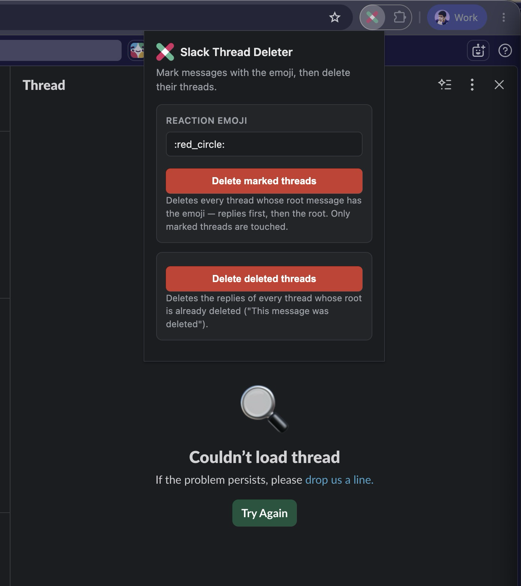

# Slack Thread Deleter

Chrome extension that deletes **entire Slack threads** — all replies, then the root message (Slack refuses to delete a root while replies exist).

Two modes in the popup:

- **Delete marked threads** — delete every thread whose root message has the configured emoji (default `:red_circle:`, any shortcode like `:x:` works and persists).
- **Delete deleted threads** — clean up replies left in threads whose root was already deleted (tombstones disappear once empty).

Only targeted threads are touched. The channel is rescanned after each deletion since Slack virtualizes the message list.

## Install (unpacked)

1. Download/clone this repo.
2. Open `chrome://extensions` → enable **Developer mode** → **Load unpacked** and select this folder.
3. Open `https://app.slack.com/` and use it.

## Usage

1. Open a Slack channel.
2. React with the configured emoji to each message whose thread you want to delete.
3. Click **Delete marked threads** (or **Delete deleted threads** for orphaned replies).

## Notes

- Only works on `app.slack.com`; messages you can't delete are skipped after a few attempts.
- Works in channels, private channels, DMs, and group DMs.
- No external dependencies, no tracking, no network calls. Only permission: Slack's domain.

## Files

- `manifest.json` — Manifest V3 manifest
- `content.js` — thread detection, selection, deletion engine
- `content.css` — dims messages while deleting
- `popup.html` / `popup.css` / `popup.js` — popup UI
- `icons/` — icons
